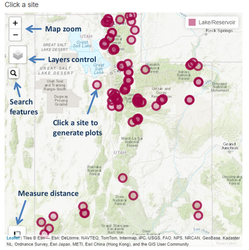

## Introduction
This application is designed to interactively visualize lake profile data collected by DWQ and cooperators and provide a platform for performing and reviewing water quality assessments based on lake profile data.
<br>

## Data
All data used by this application are available through either [Utah DWQ AWQMS](https://awqms.utah.gov) or [EPA WQP](https://www.waterqualitydata.us/) . 
The data used in this application are collected as water column profiles at lake sites throughout Utah. 
Lake profiles consist of measurements of dissolved oxygen, temperature, and pH at regular depth intervals through the water column. Intervals of 1 meter are typical 
for Utah DWQ sampling, but may be adjusted depending on the depth at any individual site. Data have been pre-processed to ensure consistency in parameter names and units 
and to calculate frequencies of exceedance of water quality criteria and widths of suitable habitat for fish based on 
areas meeting dissolved oxygen and temperature criteria for that waterbody (see the [DWQ integrated report methods](https://deq.utah.gov/legacy/programs/water-quality/monitoring-reporting/assessment/draft-2020-methodology-for-integrated-report.htm) for more details).
<br>

## Application usage
The main application input is via map selection. To build plots for any individual site, click on your desired site. 
Plots specific to that site will be rendered automatically. Several data plotting and review options are available.
Outputs will automatically render any time the user updates one of the input widgets.
<br>

## Map elements
Individual monitoring locations are displayed as circle markers on the map. 
In addition to displaying sites, site labels and polygons identifying assessment unit, beneficial use, and site-specific standard boundaries are also available. Topographic and satellite base layers are both available. 
To turn on any of these layers, hover the mouse over the layers control box (top left of map, under zoom buttons) and select one or more layers. 
Features are searchable by site and assessment unit names or identifier codes. To search for a feature, click the magnifier glass (top left of map, under the layers control box) and start topping. 
Locations matching your search will appear as you type.  
*Note:* The most recently drawn layer is "on top" of the map and is the only selectable feature. To ensure that the sites are selectable, just turn them off and back on in the layers control after 
adding other features. 

  
Figure 1. Map usage guide.
<br>
<br>

## Outputs
### Time series
The "Time series" tab shows three outputs summarizing patterns in temperature, dissolved oxygen, and pH across depth and time at the selected site.
<br>

#### Heatmap
The "Heatmap" plot shows an interpolated surface of the user selected parameter across depth and date for the selected site.  Applicable water quality criteria are shown as red contour 
lines if within the scale of the plot (figure 2). When DO/temp lens is the selected parameter, the z-axis is an interpolation between zero and one with one representing areas of the water column
where either DO, temperature, or both does not meet the applicable water quality criteria. Zero represents zones of habitable water column. Note that depending on the relative frequency and 
duration of exceedances, they may not always be visible in the interpolated figure.
  
Figure 2. Water column heatmap timeseries of water temperature. Red contour line labeled "20" indicates applicable water quality criterion.
<br>
<br>

#### Habitable width
The "Habitable width" plot shows the largest habitable width (defined as a zone where both dissolved oxygen and 
water temperature criteria are met) for each profile over time at the selected site.
  
Figure 3. Habitable width timeseries. Width of water column meeting both dissolved oxygen and temperature criteria shown as grey circles. 
Total profile depth shown as dashed blue line. Three meters is marked with a red dotted line.  
<br>
<br>

#### Water column exceedance
The "Water column exceedances" plot shows the percent of data points in each profile for which 
the applicable water quality criterion was exceeded across time at the selected site.
<br>


### Individual profiles
The "Individual profiles" tab shows two outputs for a single profile collected at the selected site and date. 
The first is a plot of temperature, dissolved oxygen, and pH against depth. On the single orofile plot applicable criteria for each parameter are plotted as horizontal lines 
with colors corresponding to the colors used for plotting parameter points. The second output is a scrollable table of the data from that profile used to generate the plot.
<br>

## Package dependencies & credits
This application depends on functions contained within the [DWQ wqTools R-package](https://github.com/utah-dwq/wqTools). 
Special thanks to R packages leaflet, leaflet.extras, and Shiny.  

### Package dependencies:  
```
	leaflet, 
	RColorBrewer, 
	akima, 
	jsonlite, 
	leaflet.extras, 
	lubridate, 
	mapedit, 
	plyr, 
	rLakeAnalyzer, 
	reshape2, 
	sf  
```

## Help & feedback
For additional help or to submit feedback or bug reports, please contact:  
Jake Vander Laan  
Utah Division of Water Quality  
jvander@utah.gov  
(801) 536-4350
